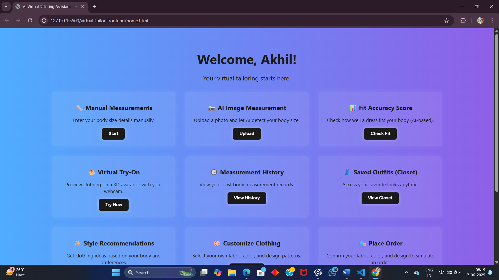
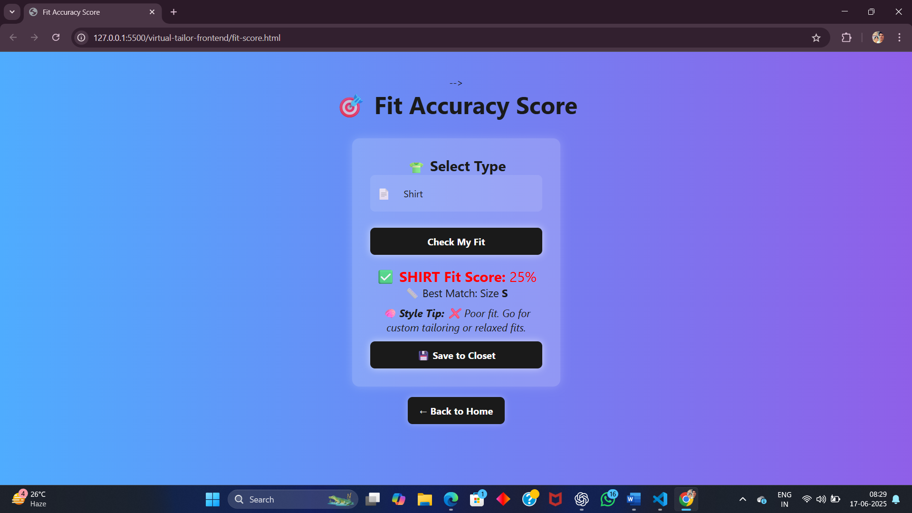
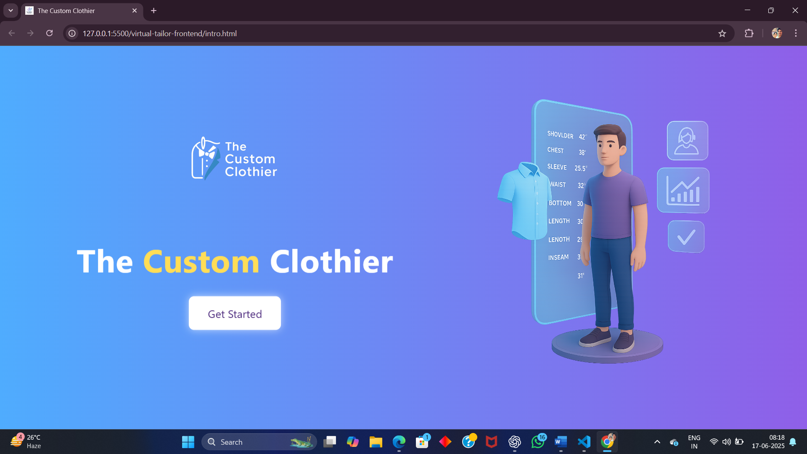
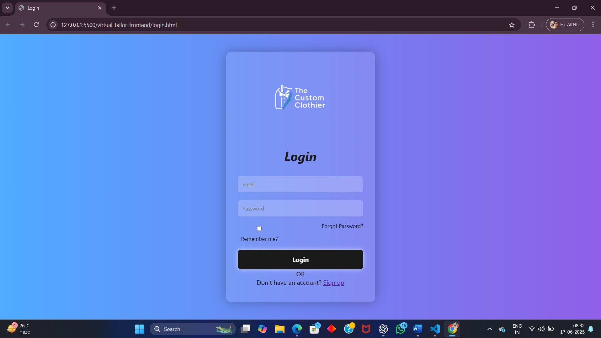
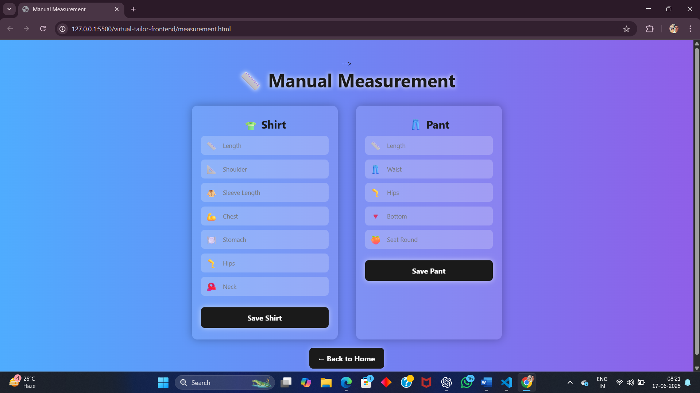
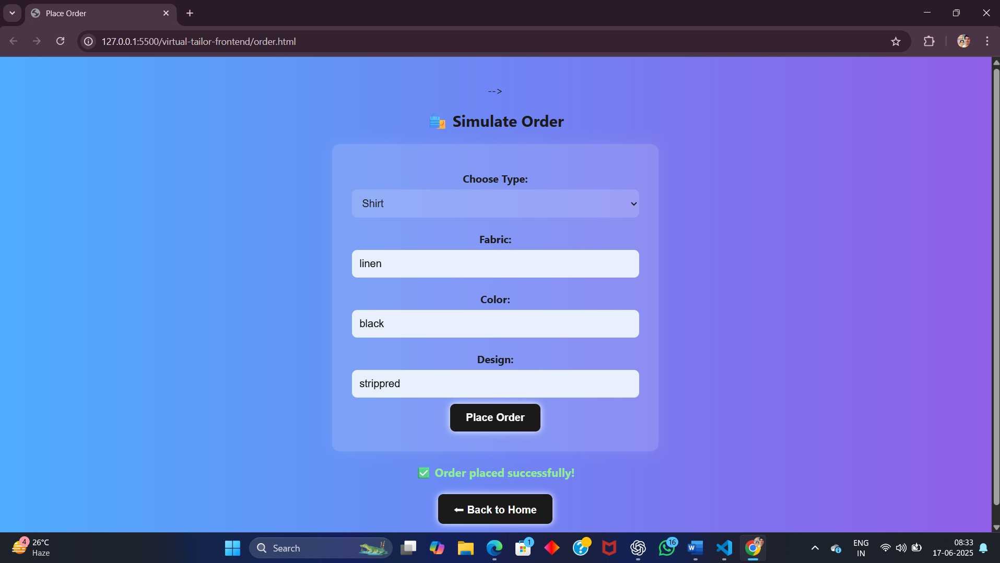

# AI Virtual Tailoring Assistant 👕👗

This project is an AI-powered tailoring assistant.  
Users can try-on clothes virtually, enter measurements manually or via image, and see fit score using AI.

## Features ✨
- Signup/Login System
- Body Measurement (Manual & AI-based)
- Fit Accuracy Score
- Virtual Try-On
- Measurement History
- Saved Outfits
- Style Recommendation
- Customization
- Place Order
- My Orders

## Technologies 🛠️
- HTML, CSS, JS
- Node.js + Express
- MongoDB

## Screenshots 📸

